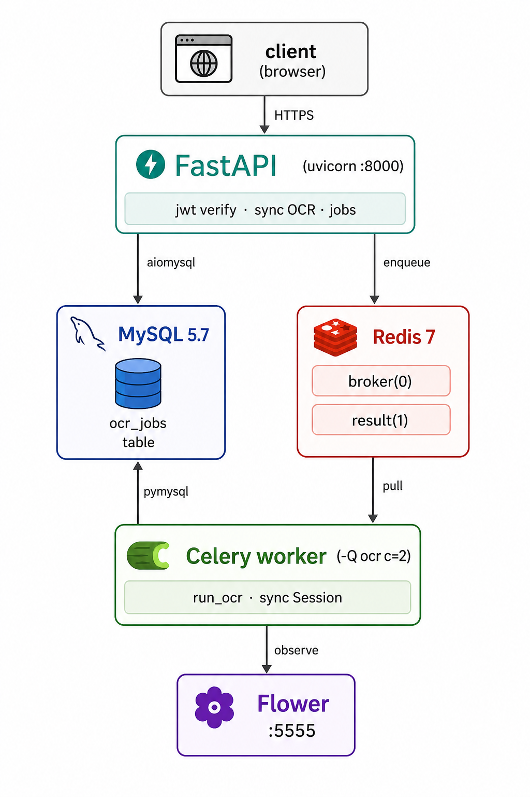

# FastAPI OCR Service

다중 OCR 엔진(EasyOCR · PaddleOCR · Naver Clova OCR)을 단일 API로 통합하고, **동기/비동기 두 가지 처리 모드**를 함께 제공하는 FastAPI 기반 OCR 서비스입니다. 무거운 추론 작업은 Celery 워커로 분리해 API 응답성을 유지하며, 작업 상태는 MySQL의 `ocr_jobs` 테이블로 추적됩니다.

> 가벼운 단발 요청은 동기 엔드포인트, PDF/대용량 이미지나 배치 처리는 비동기 잡 엔드포인트를 사용하도록 설계되어 있습니다.

---

## 목차

1. [핵심 특징](#핵심-특징)
2. [아키텍처](#아키텍처)
3. [기술 스택](#기술-스택)
4. [프로젝트 구조](#프로젝트-구조)
5. [API 명세](#api-명세)
6. [실행 방법](#실행-방법)
7. [환경변수](#환경변수)
8. [데이터베이스 & 마이그레이션](#데이터베이스--마이그레이션)
9. [Celery 워커 & 모니터링](#celery-워커--모니터링)
10. [OCR 엔진 추가하기](#ocr-엔진-추가하기)
11. [테스트](#테스트)
12. [실행 화면](#실행-화면)
13. [참고 문서](#참고-문서)

---

## 핵심 특징

| 영역 | 내용 |
|---|---|
| **멀티 엔진** | EasyOCR · PaddleOCR · Naver Clova OCR을 동일한 인터페이스(`BaseEngine`)로 추상화. 새 엔진 추가는 클래스 1개 + 등록 1줄 |
| **동기/비동기 이중 모드** | `POST /api/v1/ocr/`는 즉시 결과 반환, `POST /api/v1/ocr/jobs`는 `job_id` 발급 후 워커가 백그라운드 처리 |
| **잡 상태 추적** | `ocr_jobs` 테이블에 `pending` → `started` → `success`/`failed` 라이프사이클을 기록. 결과/에러도 함께 영속화 |
| **인증** | JWT Bearer 토큰. 발급 엔드포인트와 검증 의존성을 분리 |
| **에러 처리** | 전역 예외 핸들러로 `HTTPException`/`RequestValidationError`/`JWTError`/커스텀 비즈니스 예외를 통일된 봉투 포맷으로 변환 |
| **이중 DB 세션** | API용 `AsyncSession`(aiomysql) + 워커용 `Session`(pymysql)을 같은 MySQL에 병존 — 컨텍스트별 최적 드라이버 사용 |
| **재현 가능한 빌드** | `uv` + `uv.lock`으로 transitive 버전까지 핀, Docker는 `uv sync --frozen`으로 강제 |
| **모니터링** | Celery Flower 대시보드로 태스크 상태/큐/워커 가시성 확보 |

---

## 아키텍처



### 비동기 잡 라이프사이클

```
[Client]            [API]               [MySQL]            [Redis]            [Worker]
   │ POST /jobs       │                    │                  │                  │
   ├─────────────────►│                    │                  │                  │
   │                  │ INSERT pending     │                  │                  │
   │                  ├───────────────────►│                  │                  │
   │                  │ enqueue run_ocr    │                  │                  │
   │                  ├───────────────────────────────────────►                  │
   │ 202 {job_id}     │                    │                  │ pull             │
   │◄─────────────────┤                    │                  ├─────────────────►│
   │                  │                    │ UPDATE started   │                  │
   │                  │                    │◄─────────────────────────────────── │
   │                  │                    │                  │  do OCR (3~30s)  │
   │                  │                    │ UPDATE success   │                  │
   │                  │                    │◄─────────────────────────────────── │
   │ GET /jobs/{id}   │                    │                  │                  │
   ├─────────────────►│ SELECT             │                  │                  │
   │                  ├───────────────────►│                  │                  │
   │ {status,result}  │                    │                  │                  │
   │◄─────────────────┤                    │                  │                  │
```

### 모듈 추상화 — OCR 엔진

```
app/services/ocr/module.py
        ┌───────────────────────────┐
        │  OcrModule                │
        │   _FACTORIES = {          │
        │     "easyocr": EasyOcr,   │
        │     "paddleocr": PaddleOcr│
        │     "clovaocr": ClovaOcr, │
        │   }                       │
        └──────────┬────────────────┘
                   │ creates on first use
                   ▼
        ┌───────────────────────────┐
        │   BaseEngine (ABC)        │
        │   recognize(file_path)    │
        │   convert_to_json(result) │
        └──────────┬────────────────┘
        ┌──────────┼──────────┬──────────┐
        ▼          ▼          ▼
        EasyOcr   PaddleOcr   ClovaOcr  ...
```

엔진은 모두 **sync 메서드**(`recognize(file_path: Path)`)로 통일. API에서는 `asyncio.to_thread`로 감싸 이벤트 루프 블로킹을 회피하고, 워커에서는 직접 호출합니다.

---

## 기술 스택

### Runtime
- **Python** 3.11+
- **FastAPI** 0.135.3
- **Uvicorn[standard]** 0.44.0 (uvloop, httptools, watchfiles)
- **Pydantic** 2.13.0 / **pydantic-settings** 2.13.1
- **python-multipart** (multipart/form-data)

### OCR 엔진
- **EasyOCR** 1.7.2 (PyTorch 백엔드)
- **PaddleOCR** 2.9.1 + **paddlepaddle** 2.6.2
- **Naver Clova OCR** (외부 API · httpx 호출)

### Async Task & Queue
- **Celery** 5.6.3
- **Redis** 7.4.0 (broker + result backend, DB 0/1 분리)
- **Flower** 2.0.1 (모니터링 UI)

### Database
- **SQLAlchemy** 2.0.49 (`select()` + `execute()` 2.x 스타일)
- **aiomysql** 0.3.2 (async, FastAPI)
- **pymysql** 1.1.2 (sync, Celery & Alembic)
- **Alembic** 1.18.4 (마이그레이션, autogenerate)

### Auth & Network
- **python-jose[cryptography]** (JWT HS256)
- **httpx** (외부 OCR API 호출)

### Dev / Test / Tooling
- **pytest** 9.0.3 + **pytest-asyncio** 1.3.0
- **uv** (`uv.lock` 기반 재현 가능한 설치)
- **Jupyter Notebook** 7.5.5 (`notebooks/`에서 탐색)

---

## 프로젝트 구조

```
fastapi-ocr/
├── .docker/
│   ├── Dockerfile                       # python:3.11 + libgl1 + uv sync --frozen
│   ├── entrypoint.sh                    # SERVICE_TYPE 분기 (app | worker | flower)
│   ├── mysql/data/                      # 컨테이너 영속 볼륨
│   └── mongo/data/
├── app/
│   ├── api/
│   │   ├── __init__.py                  # /api 루트 + pkgutil 자동 수집
│   │   └── v1/
│   │       ├── __init__.py              # /v1 + 하위 라우터 자동 등록
│   │       ├── ocr/router.py            # POST /ocr/, POST /ocr/jobs, GET /ocr/jobs/{id}
│   │       └── token/router.py          # POST /token/
│   ├── core/
│   │   ├── celery.py
│   │   ├── config.py                    # pydantic-settings (.env 로더)
│   │   ├── logging.py
│   │   ├── dependencies/
│   │   │   ├── auth.py                  # verify_access_token (OAuth2PasswordBearer)
│   │   │   ├── database.py              # get_database (AsyncSession)
│   │   │   ├── file.py                  # get_ocr_validated_file
│   │   │   └── ocr.py                   # get_ocr_service / get_ocr_job_service / get_ocr_repository
│   │   ├── exceptions/
│   │   │   ├── custom.py                # BusinessException
│   │   │   └── handlers.py              # 전역 예외 → 통일 응답 봉투
│   │   └── utils/
│   │       ├── file.py                  # save_file / delete_file / 확장자 검증
│   │       ├── http_client.py
│   │       └── response.py              # success_response / error_response
│   ├── infrastructure/
│   │   └── database/session.py          # async/sync 엔진 + 세션 팩토리
│   ├── models/
│   │   ├── base.py                      # 공용 declarative Base
│   │   ├── __init__.py                  # 모델 re-export (alembic autogenerate용)
│   │   └── ocr_job.py                   # OcrJob 모델 + JobStatus enum
│   ├── module/
│   │   └── ocr/
│   │       ├── base.py                  # BaseEngine ABC
│   │       ├── easyocr.py
│   │       ├── paddleocr.py
│   │       └── clovaocr.py              # httpx sync로 Clova API 호출
│   ├── repositories/
│   │   └── ocr.py                       # OcrRepository (async DB 접근)
│   ├── schemas/
│   │   ├── base.py                      # SuccessResponse / ErrorResponse
│   │   ├── enums.py                     # OcrEngine
│   │   ├── ocr/{request,response,job}.py
│   │   └── token/response.py
│   ├── services/
│   │   ├── auth/jwt.py
│   │   └── ocr/
│   │       ├── module.py                # OcrModule (lazy 엔진 팩토리)
│   │       ├── ocr.py                   # 동기 엔드포인트 서비스
│   │       └── job.py                   # 비동기 잡 등록 서비스
│   ├── worker/
│   │   ├── celery_app.py                # Celery 인스턴스 + conf
│   │   └── tasks/
│   │       ├── ocr.py                   # run_ocr 태스크
│   │       └── test.py                  # 헬스체크용 샘플
│   └── main.py                          # FastAPI 인스턴스 + lifespan
├── migrations/
│   ├── env.py                           # target_metadata = Base.metadata
│   └── versions/                        # alembic 리비전
├── storage/
│   ├── screenshots/                     # README 캡처
│   └── uploads/ocr/                     # 업로드 파일 임시 저장
├── notebooks/                           # Jupyter (컨테이너에서 :8888로 노출)
├── tests/
│   ├── feature/ocr/
│   └── unit/ocr/
├── docker-compose.yml
├── pyproject.toml
├── uv.lock
├── alembic.ini
└── pytest.ini
```

---

## API 명세

전체 엔드포인트는 `/api/v1` 프리픽스 아래에 있습니다.

### 인증

| Method | Path | 설명 | Auth |
|---|---|---|---|
| `POST` | `/api/v1/token/` | JWT Access Token 발급 | ❌ |

#### 응답 예
```json
{
  "access_token": "eyJhbGciOiJIUzI1NiIs...",
  "token_type": "bearer"
}
```

이후 모든 OCR 엔드포인트는 `Authorization: Bearer <token>` 헤더가 필요합니다.

---

### OCR — 동기 (즉시 응답)

| Method | Path | 설명 | Auth |
|---|---|---|---|
| `POST` | `/api/v1/ocr/` | 이미지 업로드 후 즉시 OCR 결과 반환 | ✅ |

요청 (multipart/form-data):
- `file` — 이미지 파일 (`jpg` / `jpeg` / `png` / `pdf`)
- `engine` — `easyocr` / `paddleocr` / `clovaocr` (택1)

응답:
```json
{
  "code": "200",
  "data": {
    "images": [
      { "boundingPoly": [[12,18],[230,18],[230,52],[12,52]],
        "text": "INVOICE", "confidence": 0.987 },
      ...
    ]
  }
}
```

> 짧은 이미지 1장 처리에 적합. 30초 이상 걸리는 워크로드(고해상도/PDF)는 잡 엔드포인트 권장.

---

### OCR — 비동기 잡

| Method | Path | 설명 | Auth |
|---|---|---|---|
| `POST` | `/api/v1/ocr/jobs` | 잡 등록 → `job_id` 발급, 워커가 백그라운드 처리 | ✅ |
| `GET`  | `/api/v1/ocr/jobs/{job_id}` | 잡 상태/결과 조회 | ✅ |

#### 등록 응답 (202)
```json
{
  "job_id": "5b8e0a64-...",
  "status": "pending"
}
```

#### 상태 조회 응답
```json
{
  "job_id": "5b8e0a64-...",
  "status": "success",
  "engine": "easyocr",
  "file_name": "receipt.jpg",
  "result": { "images": [ ... ] },
  "info": null,
  "created_at": "2026-04-29T10:30:00",
  "started_at": "2026-04-29T10:30:01",
  "finished_at": "2026-04-29T10:30:08"
}
```

`status` 값: `pending` · `started` · `success` · `failed`

실패 시 `info`에 에러 메시지가 들어갑니다.

---

### 공통 응답 봉투

성공:
```json
{
  "code": "200",
  "data": { ... }
}
```

실패 (전역 핸들러가 변환):
```json
{
  "code": "401",
  "message": "Could not validate credentials",
  "errors": []
}
```

검증 실패 (422):
```json
{
  "code": "422",
  "message": "Validation Error",
  "errors": [
    { "field": ["body", "engine"], "message": "Input should be 'easyocr', 'paddleocr' or 'clovaocr'" }
  ]
}
```

---

## 실행 방법

### 사전 요구
- **Docker** + **Docker Compose** (권장)
- 또는 **Python 3.11+** & **uv** + 로컬 MySQL/Redis

### 1) Docker Compose (권장)

```bash
git clone <repo-url>
cd fastapi-ocr
cp .env.example .env        # 필요한 값 채우기
docker compose up -d --build
```

기동되는 컨테이너:

| 컨테이너 | 포트(host:container) | 역할 |
|---|---|---|
| `fastapi_ocr` | `9093:8000`, `8888:8888` | API + Jupyter |
| `fastapi_ocr-celery` | — | Celery 워커 (`-Q ocr`, concurrency=2) |
| `fastapi_ocr-flower` | `5555:5555` | Celery 모니터링 |
| `fastapi_ocr-mysql` | `3306:3306` | MySQL 5.7 (utf8mb4) |
| `fastapi_ocr-redis` | `6379:6379` | broker(DB 0) + result(DB 1) |
| `fastapi_ocr-mongodb` | `27017:27017` | (예비, 현재 사용 안 함) |

엔드포인트:
- API:           `http://localhost:9093`
- Swagger UI:    `http://localhost:9093/docs`
- ReDoc:         `http://localhost:9093/redoc`
- Flower:        `http://localhost:5555`
- Jupyter:       `http://localhost:8888` (`notebooks/`)

DB 마이그레이션 적용:
```bash
docker compose exec app uv run alembic upgrade head
```

### 2) 로컬 (uv)

```bash
uv sync                      # uv.lock 기반 재현 가능 설치
cp .env.example .env         # DB_HOST 등 로컬 값으로 수정

# 마이그레이션
uv run alembic upgrade head

# API
uv run uvicorn app.main:app --reload --host 0.0.0.0 --port 8000

# 별도 터미널 — Celery 워커
uv run celery -A app.worker.celery_app worker --loglevel=info -Q ocr --concurrency=2

# 별도 터미널 — Flower (선택)
uv run celery -A app.worker.celery_app flower --port=5555
```

### 3) 빠른 동작 확인

```bash
# 1. 토큰 발급
TOKEN=$(curl -sX POST http://localhost:9093/api/v1/token/ | jq -r .access_token)

# 2. 동기 OCR
curl -X POST http://localhost:9093/api/v1/ocr/ \
  -H "Authorization: Bearer $TOKEN" \
  -F "engine=easyocr" \
  -F "file=@storage/screenshots/sample.png"

# 3. 비동기 잡 등록
JOB=$(curl -sX POST http://localhost:9093/api/v1/ocr/jobs \
  -H "Authorization: Bearer $TOKEN" \
  -F "engine=paddleocr" \
  -F "file=@storage/screenshots/sample.png" | jq -r .job_id)

# 4. 결과 폴링
curl -H "Authorization: Bearer $TOKEN" \
  http://localhost:9093/api/v1/ocr/jobs/$JOB
```

---

## 환경변수

`.env`는 `.env.example`을 복사해 채웁니다. 핵심 항목:

```env
# App
APP_NAME=fastapi-ocr
APP_ENV=local
APP_DEBUG=true
APP_URL=http://localhost:9093

# MySQL
DB_HOST=fastapi_ocr-mysql       # 로컬 직접 실행 시 127.0.0.1
DB_PORT=3306
DB_DATABASE=fastapi
DB_USERNAME=root
DB_PASSWORD=root

# Celery / Redis
CELERY_BROKER_URL=redis://fastapi_ocr-redis:6379/0
CELERY_RESULT_BACKEND=redis://fastapi_ocr-redis:6379/1

# Storage (업로드 파일 디렉터리)
STORAGE_PATH=storage

# JWT
JWT_EXPIRE_MINUTES=1440
JWT_SECRET_KEY=<랜덤 시크릿>
JWT_ALGORITHM=HS256
JWT_SUBJECT=fastapi-ocr

# Naver Clova OCR
CLOVA_OCR_APIGW_INVOKE_URL=https://...apigw.ntruss.com/custom/v1/...
CLOVA_OCR_SECRET_KEY=<발급받은 시크릿>
```

> `pydantic-settings`가 시작 시점에 검증합니다. 누락 항목은 즉시 에러로 보고됩니다.

---

## 데이터베이스 & 마이그레이션

### 세션 분리 — async / sync

| 컨텍스트 | 엔진 | 드라이버 | 사용 |
|---|---|---|---|
| FastAPI | `async_engine` | `aiomysql` | 라우터 의존성 `get_database` |
| Celery 워커 | `sync_engine` | `pymysql` | `with sync_session_factory() as session:` |
| Alembic | `sync_engine` | `pymysql` | `migrations/env.py` |

두 엔진 모두 `pool_pre_ping=True` + `pool_recycle=3600`으로 끊긴 커넥션을 회복하고, MySQL의 `wait_timeout` 사고를 예방합니다. `expire_on_commit=False`로 commit 후에도 객체 속성에 안전하게 접근할 수 있게 했습니다.

### `OcrJob` 테이블

| 컬럼 | 타입 | 설명 |
|---|---|---|
| `id` | `VARCHAR(50)` PK | UUID4 |
| `status` | `ENUM` | `pending` · `started` · `success` · `failed` (인덱스) |
| `engine` | `VARCHAR(30)` | `easyocr` · `paddleocr` · `clovaocr` |
| `file_name` | `VARCHAR(255)` | 원본 업로드 파일명 |
| `file_path` | `VARCHAR(512)` | 저장된 경로 (storage/uploads/ocr/...) |
| `result` | `JSON` | 성공 시 OCR 결과 |
| `info` | `JSON` | 실패 시 에러 메시지/로그 |
| `created_at` / `started_at` / `finished_at` | `DATETIME` | 라이프사이클 타임스탬프 |

### Alembic

```bash
# 새 모델/스키마 변경 후
docker compose exec app uv run alembic revision --autogenerate -m "add ocr_jobs"
# 자동생성된 versions/*.py 검토 후
docker compose exec app uv run alembic upgrade head

# 롤백
docker compose exec app uv run alembic downgrade -1
```

`migrations/env.py`는 `Base.metadata`를 `target_metadata`로 사용하며, `from app import models` 한 줄로 모든 모델을 등록합니다. 새 모델 추가 시 `app/models/__init__.py`에 export 한 줄만 추가하면 자동 인식됩니다.

---

## Celery 워커 & 모니터링

### 큐 정책

```python
celery.conf.task_queues       = {"ocr": {}, "default": {}}
celery.conf.task_default_queue = "ocr"

worker_prefetch_multiplier = 1     # OCR은 무거우므로 한 번에 1개만 선점
task_acks_late             = True  # 워커 죽으면 broker가 다른 워커에 재할당
task_reject_on_worker_lost = True
task_time_limit            = 60*5  # hard 5분
task_soft_time_limit       = 60*4  # soft 4분 (cleanup 기회)
task_track_started         = True
worker_max_tasks_per_child = 200   # OCR 모델 메모리 누수 방지
timezone                   = "Asia/Seoul"
```

> `acks_late` + 멱등성: 워커가 도중에 죽어도 같은 `job_id`로 재실행 → 같은 row를 갱신만 하므로 부작용 없음.

### 태스크 — `run_ocr`

`app/worker/tasks/ocr.py`:
```python
@celery.task
def run_ocr(job_id: str):
    with sync_session_factory() as session:
        job = session.get(OcrJob, job_id)
        if job is None:
            return

        job.status, job.started_at = JobStatus.STARTED, func.now()
        session.commit()

        try:
            engine = OcrModule(job.engine).engine
            result = engine.recognize(Path(job.file_path))
        except Exception as e:
            job.status, job.info = JobStatus.FAILED, {"error": str(e)}
            job.finished_at = func.now()
            session.commit()
            raise
        else:
            job.status, job.result = JobStatus.SUCCESS, result
            job.finished_at = func.now()
            session.commit()
```

핵심 원칙:
- STARTED 표시는 **즉시 commit** — 외부에서 진행 상황을 즉시 조회 가능
- `try`는 OCR 추론 부분만 감쌈 — 인프라 에러는 잡 자체를 FAILED로 기록할 의미가 없음
- `except`에서 반드시 commit + `raise` — Celery가 FAILED로 인식하도록
- `else`에 성공 처리 분리 — commit 자체에서 발생하는 예외가 except에 잡혀 상태가 꼬이는 것 방지

### Flower

`http://localhost:5555` — 큐별 대기/처리 통계, 워커 상태, 태스크 STARTED/SUCCESS/FAILURE 추적을 실시간으로 확인할 수 있습니다.

---

## OCR 엔진 추가하기

새 엔진을 추가하려면 클래스 1개 + 등록 1줄이면 됩니다.

### 1. 엔진 클래스 작성

`app/module/ocr/myocr.py`:
```python
from pathlib import Path
from app.module.ocr.base import BaseEngine


class MyOcr(BaseEngine):
    def __init__(self):
        self.client = ...  # 모델 로드, API 클라이언트 등

    def recognize(self, file_path: Path) -> dict:
        raw = self.client.run(str(file_path))
        return self.convert_to_json(raw)

    def convert_to_json(self, raw) -> dict:
        return {
            "images": [
                {"boundingPoly": ..., "text": ..., "confidence": ...}
                for r in raw
            ]
        }
```

### 2. 팩토리에 등록

`app/services/ocr/module.py`:
```python
from app.module.ocr.myocr import MyOcr

class OcrModule:
    _FACTORIES = {
        "easyocr": EasyOcr,
        "paddleocr": PaddleOcr,
        "clovaocr": ClovaOcr,
        "myocr":    MyOcr,        # ← 추가
    }
```

### 3. Enum에 추가

`app/schemas/enums.py`:
```python
class OcrEngine(str, Enum):
    easyocr   = "easyocr"
    paddleocr = "paddleocr"
    clovaocr  = "clovaocr"
    myocr     = "myocr"           # ← 추가
```

끝. API/워커 양쪽에서 즉시 사용 가능합니다. **lazy init** 덕분에 `MyOcr`는 처음 호출되는 시점에만 메모리에 올라갑니다.

---

## 테스트

```bash
uv run pytest                       # 전체
uv run pytest tests/unit            # 단위 테스트만
uv run pytest tests/feature         # 기능 테스트만
uv run pytest -k ocr -v             # 키워드 필터
uv run pytest --asyncio-mode=auto   # async 자동 모드
```

`pytest.ini`는 async 테스트를 자동 인식하도록 구성되어 있습니다.

---

## 실행 화면

### 샘플 이미지


### 추출 결과 비교

| Naver Clova OCR | EasyOCR | PaddleOCR |
|---|---|---|
|  |  |  |

### Swagger UI
FastAPI가 자동 생성하는 OpenAPI 문서로 모든 엔드포인트의 요청/응답 스키마와 예시를 인터랙티브하게 확인할 수 있습니다.

- Swagger UI: `http://localhost:9093/docs`
- ReDoc: `http://localhost:9093/redoc`

---