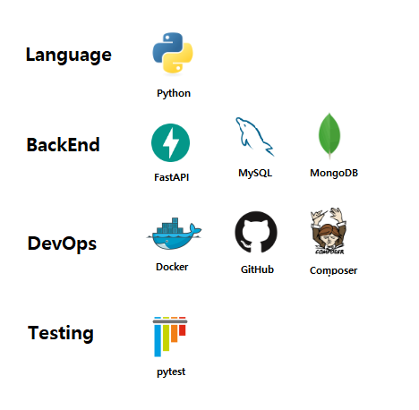

# FastAPI OCR 서비스

FastAPI 기반의 OCR 서비스로, EasyOCR, PaddleOCR, ClovaOCR 등 다양한 OCR 엔진을 지원합니다. 이미지에서 텍스트를 추출하는 API를 제공하며, 모듈화된 구조로 쉽게 확장이 가능합니다.


## 🚀 프로젝트 개요

다양한 OCR 엔진을 지원하는 API 서비스를 구현합니다. 주요 특징으로는:
- FastAPI 기반의 고성능 비동기 API 서버
- Docker를 통한 컨테이너화된 개발 환경
- 다양한 OCR 엔진 지원 (EasyOCR, PaddleOCR, ClovaOCR)
- 모듈화된 아키텍처로 쉽게 새로운 OCR 엔진 추가 가능
- 자동화된 테스트 시스템 (Unit & Feature 테스트)


## 🛠️ 기술 스택



### 주요 버전 정보
- **Python**: 3.8+
- **FastAPI**: 0.110.0
- **Pydantic**: 2.11.5
- **OCR 엔진**:
  - EasyOCR 1.7.2
  - PaddleOCR (latest)
  - Clova OCR (API 기반)
- **데이터베이스**:
  - SQLAlchemy 2.0.41 (ORM)
  - aiomysql 0.2.0 (비동기 MySQL 클라이언트)
  - motor 3.7.1 (비동기 MongoDB 클라이언트)

### 개발 도구
- 테스트: pytest, pytest-asyncio
- 문서화: Swagger UI, ReDoc (FastAPI 기본 제공)


## 🏗️ 프로젝트 구조

```text
fastapi-ocr/
├── .docker/                  # Docker 관련 설정 파일
├── app/                      # 애플리케이션 코드
│   ├── api/                  # API 엔드포인트
│   │   └── v1/               # API 버전 1
│   │       └── ocr/          # OCR 관련 API
│   │   └── router_collector.py
│   │
│   └── domain/               # 도메인 로직
│       └── ocr/              # OCR 도메인 로직
│           ├── dependencies/  # 의존성 주입
│           ├── engines/       # OCR 엔진 구현체
│           │   ├── base_engine.py  # 추상 기본 클래스
│           │   ├── easyocr.py      # EasyOCR 구현
│           │   ├── paddleocr.py    # PaddleOCR 구현
│           │   └── clovaocr.py     # Clova OCR 구현
│           ├── modules/       # OCR 모듈
│           ├── repositories/  # 데이터 접근 계층
│           ├── schemas/       # Pydantic 모델
│           ├── services/      # 비즈니스 로직
│           └── validators/    # 유효성 검사기
│
├── common/                   # 공통 유틸리티
│   ├── constants/            # 상수 정의
│   ├── exceptions/           # 예외 처리
│   ├── helpers/              # 도우미 함수
│   └── utils/                # 유틸리티 함수
│
├── config/                   # 설정 파일
│   └── settings.py           # 애플리케이션 설정
│
├── databases/                # 데이터베이스 관련
│
├── storage/                  # 파일 저장소
│
├── tests/                    # 테스트 코드
│
├── .env                      # 환경 변수
├── main.py                   # 애플리케이션 진입점
└── requirements.txt          # 의존성 목록
```


## ✨ 기능 목록

- [x] 멀티 OCR 엔진 지원 (EasyOCR, PaddleOCR, ClovaOCR)
- [x] 비동기 API 엔드포인트
- [x] 파일 업로드 및 처리
- [x] 모듈화된 아키텍처
- [x] 단위 테스트 및 통합 테스트
- [x] API 문서화