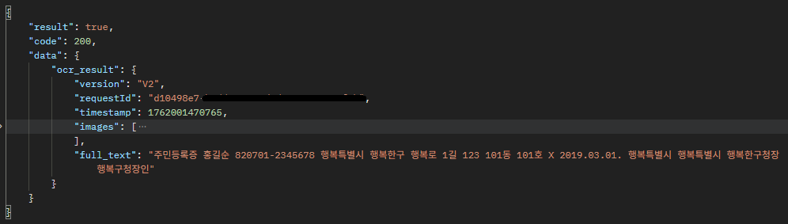
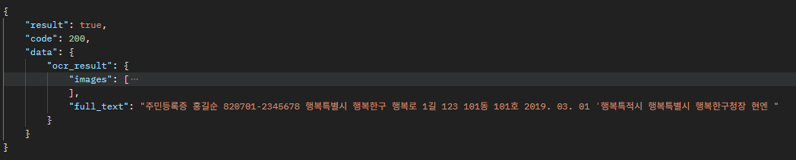
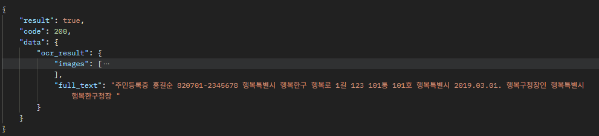

# 다중 엔진 OCR API

FastAPI 기반 OCR 서비스. EasyOCR · PaddleOCR · Naver Clova OCR 세 엔진을 하나의 인터페이스로 통합하고, **동기 / 비동기 잡** 두 가지 처리 모드를 제공합니다. 무거운 추론은 Celery 워커로 분리하고 잡 상태는 MySQL `ocr_jobs` 테이블에 영속화합니다.

## 🚀 주요 기능

- **멀티 엔진**: `BaseEngine` ABC로 추상화된 EasyOCR / PaddleOCR / Clova OCR
- **동기 OCR**: `POST /api/v1/ocr/` — 업로드 후 즉시 결과 반환 (가벼운 단발 요청용)
- **비동기 잡**: `POST /api/v1/ocr/jobs` — `job_id` 발급 후 Celery 워커가 백그라운드 처리, MySQL `ocr_jobs` 테이블에 `pending → started → success/failed` 라이프사이클 기록
- **JWT 인증**: `POST /api/v1/token/`에서 발급, 이후 모든 OCR 엔드포인트는 `Authorization: Bearer` 필요

## 🛠️ 기술 스택

| 영역 | 사용 기술 |
|---|---|
| Web | FastAPI 0.135.3, Uvicorn 0.44.0 (standard), python-multipart |
| 검증/설정 | Pydantic 2.13.0, pydantic-settings 2.13.1 |
| OCR 엔진 | EasyOCR 1.7.2, PaddleOCR 2.9.1, paddlepaddle 2.6.2, Naver Clova OCR (HTTP API) |
| 작업 큐 | Celery 5.6.3, Redis 7.4.0, Flower 2.0.1 |
| 데이터베이스 | SQLAlchemy 2.0.49, aiomysql 0.3.2, pymysql 1.1.2, Alembic 1.18.4 |
| 인증 / 네트워크 | python-jose[cryptography] (JWT HS256), httpx |
| 테스트 / 빌드 | pytest 9.0.3, pytest-asyncio 1.3.0 |
| 런타임 | Python 3.11+ |

## 📦 프로젝트 구조

```text
fastapi-ocr/
├── .docker/
│   ├── Dockerfile                       # python:3.11 + libgl1 + uv sync --frozen
│   └── entrypoint.sh                    # SERVICE_TYPE 분기 (app | worker | flower)
├── app/
│   ├── api/
│   │   ├── __init__.py                  # /api 루트 + pkgutil 자동 수집
│   │   └── v1/
│   │       ├── ocr/router.py            # POST /ocr/, POST /ocr/jobs, GET /ocr/jobs/{id}
│   │       └── token/router.py          # POST /token/
│   ├── core/
│   │   ├── celery.py
│   │   ├── config.py                    # pydantic-settings (.env 로더)
│   │   ├── logging.py
│   │   ├── dependencies/
│   │   │   ├── auth.py                  # verify_access_token (OAuth2PasswordBearer)
│   │   │   ├── database.py              # get_database (AsyncSession)
│   │   │   ├── file.py                  # get_ocr_validated_file
│   │   │   └── ocr.py                   # get_ocr_service / get_ocr_job_service / get_ocr_repository
│   │   ├── exceptions/
│   │   │   ├── custom.py                # BusinessException
│   │   │   └── handlers.py              # 전역 예외 → 통일 응답 봉투
│   │   └── utils/
│   │       ├── file.py                  # save_file / delete_file / 확장자 검증
│   │       ├── http_client.py
│   │       └── response.py              # success_response / error_response
│   ├── infrastructure/
│   │   └── database/session.py          # async/sync 엔진 + 세션 팩토리
│   ├── models/
│   │   ├── base.py                      # 공용 declarative Base
│   │   ├── __init__.py                  # 모델 re-export (alembic autogenerate용)
│   │   └── ocr_job.py                   # OcrJob 모델 + JobStatus enum
│   ├── module/
│   │   └── ocr/
│   │       ├── base.py                  # BaseEngine ABC
│   │       ├── easyocr.py
│   │       ├── paddleocr.py
│   │       └── clovaocr.py              # httpx로 Clova API 호출
│   ├── repositories/
│   │   └── ocr.py                       # OcrRepository (async DB 접근)
│   ├── schemas/
│   │   ├── base.py                      # SuccessResponse / ErrorResponse
│   │   ├── enums.py                     # OcrEngine
│   │   ├── ocr/{request,response}.py
│   │   └── token/response.py
│   ├── services/
│   │   ├── auth/jwt.py
│   │   └── ocr/
│   │       ├── module.py                # OcrModule (엔진 팩토리)
│   │       ├── ocr.py                   # 동기 엔드포인트 서비스
│   │       └── job.py                   # 비동기 잡 등록 서비스
│   ├── worker/
│   │   ├── celery_app.py                # Celery 앱 (queue: ocr, default)
│   │   └── tasks/
│   │       ├── ocr.py                   # run_ocr 태스크
│   │       └── test.py
│   └── main.py                          # FastAPI 진입점 (lifespan, 예외 핸들러 등록)
├── migrations/
│   ├── env.py                           # target_metadata = Base.metadata
│   └── versions/                        # alembic 리비전
├── storage/
│   ├── screenshots/
│   └── uploads/ocr/                     # 업로드 파일 임시 저장
├── notebooks/
├── tests/
│   ├── feature/ocr/
│   └── unit/ocr/
├── docker-compose.yml
├── pyproject.toml
├── uv.lock
├── alembic.ini
└── pytest.ini
```

## 🐳 실행 (Docker Compose)

```bash
docker compose up -d --build
docker compose exec app uv run alembic upgrade head
```

| 서비스 | 포트 (host:container) | 용도 |
|---|---|---|
| app (FastAPI) | `9093:8000`, `8888:8888` | API + Jupyter |
| celery worker | — | OCR 태스크 처리 (`-Q ocr`, concurrency=2) |
| flower | `5555:5555` | Celery 모니터링 |
| mysql | `3306:3306` | MySQL 5.7 (utf8mb4) |
| redis | `6379:6379` | Celery broker(DB 0) + result(DB 1) |
| mongo | `27017:27017` | 예비 (현재 미사용) |

## 📡 API

### `POST /api/v1/token/`

JWT Access Token 발급. 현재 입력 없이 토큰을 발급합니다.

```json
{ "access_token": "eyJhbGciOiJIUzI1NiIs...", "token_type": "bearer" }
```

### `POST /api/v1/ocr/` (동기, 인증 필요)

`multipart/form-data`로 이미지를 업로드하고 즉시 결과를 받습니다.

- `file`: 이미지 파일 (`jpg` / `jpeg` / `png` / `pdf`)
- `engine`: `easyocr` / `paddleocr` / `clovaocr`

```json
{
  "code": "200",
  "data": {
    "images": [
      { "boundingPoly": [[12,18],[230,18],[230,52],[12,52]],
        "text": "INVOICE", "confidence": 0.987 }
    ]
  }
}
```

### `POST /api/v1/ocr/jobs` (비동기, 인증 필요)

잡을 등록하고 `job_id`를 받습니다. Celery 워커가 `run_ocr` 태스크로 처리하면서 `ocr_jobs` 테이블의 status를 `pending → started → success/failed`로 갱신합니다.

### `GET /api/v1/ocr/jobs/{id}` (인증 필요)

잡 상태/결과 조회.

## 🧪 비동기 잡 라이프사이클

`POST /api/v1/ocr/jobs`로 등록된 잡은 다음 흐름을 따릅니다.

1. API가 `OcrJob` row를 `pending`으로 INSERT (aiomysql)
2. `run_ocr.delay(job_id)`로 Celery에 enqueue
3. 워커가 `sync_session_factory()`로 SELECT → status `started` UPDATE → commit
4. `OcrModule(engine).recognize(file_path)` 실행
5. 성공 시 `success` + `result`, 실패 시 `failed` + `info`(에러 메시지/로그)로 UPDATE + commit

### Celery 워커 설정 요약 (`app/worker/celery_app.py`)

- `worker_prefetch_multiplier=1` — 무거운 OCR은 한 번에 1개만 선점
- `task_acks_late=True`, `task_reject_on_worker_lost=True` — 워커가 죽으면 broker가 재할당 (멱등성 전제)
- `task_time_limit=300`, `task_soft_time_limit=240` — hard 5분 / soft 4분
- `worker_max_tasks_per_child=200` — OCR 모델 메모리 누수 방지
- `task_track_started=True` — Flower에서 PENDING / STARTED 구분 가능

## ⚠️ 남은 제한 사항

- **`run_ocr` 태스크 본체 미구현**: `app/worker/tasks/ocr.py`의 try 블록이 `pass`로 비어 있고 성공 시 `result` 대입도 주석 처리됨. STARTED 갱신만 동작하고 실제 엔진 호출은 없는 상태.
- **잡 조회 엔드포인트 미구현**: `GET /api/v1/ocr/jobs/{id}`는 `pass`. status / result 직렬화 스키마(`OcrJobResponse`)도 아직 없음.
- **`POST /api/v1/ocr/jobs` 응답 임시값**: 현재 `{"message": "test"}`를 반환. `202 {job_id, status}` 형태로 정리 필요.
- **`OcrModule.OCR_ENGINES`가 eager**: 클래스 본문에서 세 엔진을 모두 `EasyOcr()` / `PaddleOcr()` / `ClovaOcr()`로 즉시 인스턴스화. 모듈 임포트만으로 EasyOCR · PaddleOCR이 메모리에 적재됨. lazy 팩토리(`_FACTORIES = {key: class}` + 최초 호출 시 생성)로 전환 권장.
- **`BaseEngine.recognize` 시그니처 불일치**: ABC는 `recognize(file_path: Path)`인데 `EasyOcr.recognize(file: UploadFile)`로 받음. 추상 계약을 깨고 있어 `Path`로 통일 필요.
- **`OcrRepository.create_ocr_job`이 commit하지 않음**: 현재 `db.add` 후 호출 측(`OcrJobService.create_ocr_job`)에서 commit. 책임 경계가 모호 — 트랜잭션 경계를 서비스에 명시하거나 UoW 패턴 도입 검토.

### 권장 다음 단계

1. `run_ocr` 본체 구현: 미구현 기능 구현
2. `GET /jobs/{id}` 구현 + `OcrJobResponse` 스키마 추가
3. `OcrModule`을 lazy 팩토리로 전환해 워커/앱 부팅 비용 절감

## 📸 실행 화면

### 샘플 이미지


### 추출 결과 비교

| Naver Clova OCR | EasyOCR | PaddleOCR |
|---|---|---|
|  |  |  |